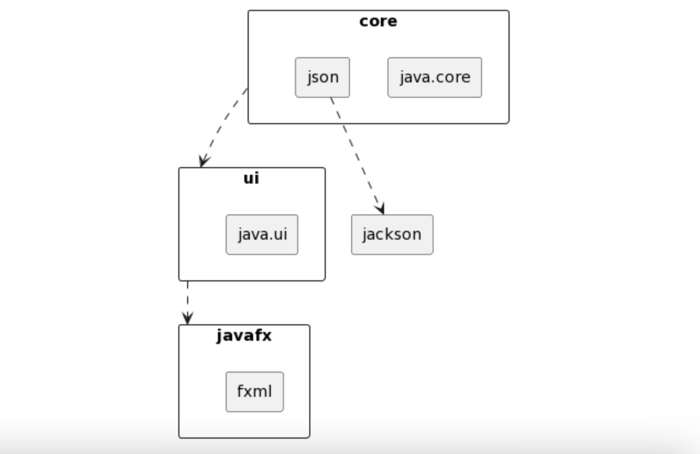

[open in Eclipse Che](https://che.stud.ntnu.no/#https://gitlab.stud.idi.ntnu.no/it1901/groups-2023/gr2323/gr2323?new)

# BookTracker - Oversikt og Struktur
Prosjektet er konfigurert med **maven** som byggesystem. Det har i hovedssak de tre modulene core, ui og restserver. Brukergrensesnittet befinner seg i modulen ui. Prosjektet benytter javafx version 17.0.8 og Apache Maven 3.9.4.

Kodeprosjektet er plassert i mappen **[bookTracker](bookTracker)**. Denne mappen inneholder en **[readme-fil](bookTracker/README.md)** som fungerer som en mer forklarende fil om hvordan selve applikasjonen er bygget opp og fungerer, samt brukerhistorier som beskriver litt av prosjektfremgangen. 

## Bygging og kjøring av prosjektet 
Til bygging og kjøring av prosjektet benyttes maven. For å kunne kjøre prosjektet må man først kjøre `mvn clean install` i bookTracker-mappen for å rense, bygge og installere prosjektet lokalt. Alle testene vil da bli sjekket og en kvalitetssjekking av prosjektet vil bli gjort. For å få igang restserveren må kommandoen `mvn spring-boot:run` i restserver-mappen kjøres, i en egen terminal. Etter dette kan man gå inn i ui-mappen og kjøre `mvn javafx:run` for å kjøre applikasjonen, i en annen terminal. Begge kommandoene må kjøres inne i `workspace/gr2323/bookTracker`, førstenevnte i `workspace/bookTracker/restserver` og sistnevnte i `workspace/bookTracker/ui`. For å komme seg til bookTracker kan man bruke `cd bookTracker` fra `workspace/gr2323`. Kommandoen `mvn test` brukes for å bare kjøre testene. Hvis det er ønskelig å kjøre applikasjonen uten å kjøre testene, kan `mvn clean install -DskipTests` brukes. Dette vil også spare tid. 

## Organisering 

### modul organiseringen av koden

Modulene i prosjektet inneholder fire mapper for kildekode, koden selv, tester for koden, og ressurser for både hovedkoden og testene:

- **src/main/java** befinner koden til applikasjonen seg
- **src/main/resources** ressurser for hovedkoden som er nyttig for applikasjonen, f.eks. FXML-filer, data-filer og bilde-filer.
- **src/test/java** inneholder testkoden
- **src/test/resources** ressurser som tilhører testkoden og som brukes av de. Dette kan være FXML-filer, data-filer og bilde-filer.

### core 
core-moduelen er delt inn i to packages:
- **[core](bookTracker/core/src/main/java/core/)** 
- **[json](bookTracker/core/src/main/java/json/)** 

**[core](bookTracker/core)** inneholder alle klasser for logikk til applikasjonen vår. I vårt prosjekt skal en bruker kunne registrere en profil, logge inn med denne, og videre ha mulighet til å legge til og slette bøker i en personlig bokhylle. Klassene danner til sammen logikk som håndterer dette.

**[json](bookTracker/json)** inneholder klasser som brukes til å serialisere og deserialisere java-objekter til og fra json. Til dette har vi benyttet oss av Jackson-biblioteket.

### ui
**[ui](notion://www.notion.so/bookTracker/ui)** inneholder én package, **[ui](notion://www.notion.so/bookTracker/ui/src/main/java/ui)** . Denne inneholder alle kontrollerne til brukergrensesnitett i applikasjonen vår, samt implementasjonene våre av dataaccess.  
Vi har i prosjektet benyttet JavaFX og FXML. Hver scene i appen vår har en tilhørende FXML-fil med en tilhørende kontroller. FXML-filene er plassert i en egen resources-mappe i ui-modulen. FXML-filene er i  **[ui-resources](notion://www.notion.so/bookTracker/ui/src/main/resources/ui)**. Kontrollerne som FXML-filene er knyttet opp til ligger i **[ui](notion://www.notion.so/bookTracker/ui/src/main/java/ui)**. Registrering og Logging inn av bruker, profilside til brukere og bibliotek er en del av brukerinteraksjonen med vårt brukergrensesnitt.  

Klassene DirectDataAccess og RemoteDataAccess har ulike metoder for å hente data. DirectDataAccess benytter seg direkte av  persistence for å lese og skrive fra fil. Denne klassen brukes til testing av ui og lagrer lokalt.
RemoteDataAccess har metoder som kaller på REST API-et for å lese og skrive til fil, og brukes mens appen og serveren kjører.
Når applikasjonen kjøres åpnes den i localhost: [...]

### restserver
Prosjektet er konfigurert med Spring Boot og inneholder en restserver-modul. **[restserver](bookTracker/restserver)**  inneholder én package med klasser som er ansvarlige for å håndtere de forskjellige HTTP-forespørslene til og fra serveren. I ui-modulen befinner det seg en RemoteDataAccess-klasse som inneholder metoder for å utføre HTTP-kall. Serveren kjøres på `localhost:8080`

### arkitektur-oversikt
Her er pakkediagram som viser arkitekturen til prosjektet vårt. Diagrammet illustrere modulene i prosjektet og hvordan de avhenger av hverandre 

## Testdekningsgrad 
### jacoco
Jacoco er et verktøy som sjekker prosjektets testdekningsgrad.  gir detaljert innsikt i hvilken del av koden som testes i løpet av kjøretiden. Dette kan hjelpe med å identifisere områder av koden som mangler testdekning, slik at kvaliteten på koden kan forbedres. 

For å få mest mulig ut av Jacoco i Visual Studio Code, har det i dette prosjektet blitt brukt to extensions; Live Server og Coverage Gutters. Liver Server gjør at man kan åpne opp en detaljert oversikt i nettleseren, mens Code Gutters gjør at man kan se hvilke deler som er testet, direkte i koden. 

## javadoc
For å klare å sette seg enklere inn i prosjektet er det lagt til kommentarer til alle klassene og metodene. Dette vil gi en bredere forståelse over hvordan prosjektet er bydg opp og fungerer. Mer informasjon om akkurat dette er i **[README](https://gitlab.stud.idi.ntnu.no/it1901/groups-2023/gr2323/gr2323/-/blob/master/bookTracker/README.md) 

### spotbugs 
Spotbugs er et statisk analyse verktøy som tester koden for vanlige feil. Den identifiserer potensielle problemer, bugs og svake punkter i koden. For så å gi innsikt og tilbakemelding om hvordan kodekvaliteten og sikkerheten til softwaren kan forbedres. Spotbugs sørger for at koden er sikker, forutsigbar og lesbar. 

For å kjøre spotbugs kan man bruke kommandoene `mvn verify`, `mvn spotbugs:check` og `mvn spotbugs:gui`, sistnevnte er den kommandoen som gir  tilbakemelding. Tilbakemeldingen vil komme i et spotbugs vindu.

### checkstyle 
Checkstyle er et verktøy som bevarer kodekvaliteten og sørger for at en bestemt kodestandard blir holdt. Hovedoppgaven til verktøyet er å sjekke overfladiske og stilmessige egenskaper til koden som tekst.  Den sørger for at koden holder seg konsistent slik at den er enklere å lese og forstå. Checkstylen i prosjektet er konfigurert med standard “Google Java Style ”. Filen bookTracker\config\checkstyle\eclipse-java-google-style.xml er den som definerer reglene og retningslinjene på formatet på prosjektet  vårt ( koden vår). 

For å kjøre checkstyle kan man kjøre kommandoene `mvn verify` og  `mvn checkstyle:check`

- I prosjektet har vi fremdeles endel innrykkfeil i checkstyle, som skyldes at checkstyle ikke lar seg endre til innrykk 4 istedet for 2. 

Utvidet informasjon om valg rundt implementasjonen av checkstyle og spotbug, befinner seg i **[README](https://gitlab.stud.idi.ntnu.no/it1901/groups-2023/gr2323/gr2323/-/blob/master/bookTracker/README.md) i "Kommentarer til prosjektet".

## maven
byggesystemet vårt har tillegg for: 
- oppsett av java (**maven-compiler-plugin**)
- testing (**maven-surefire-plugin**)
- kjøring av javafx (**javafx-maven-plugin**)
- testdekningsgrad med jacoco (**jacoco-maven-plugin**)
- sjekking av kodekvalitet med checkstyle (**maven-checkstyle-plugin**) og spotbugs (**spotbugs-maven-plugin**)
- oppsett av server med spring-boot (**spring-boot-maven-plugin**)

## Klassediagram

## Sekvensdiagram